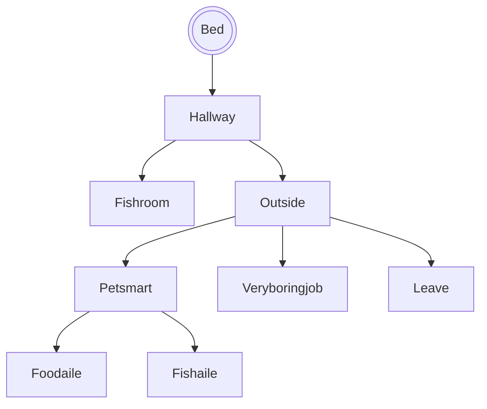

# Chris Needs Coffee

## Setting

This game takes place at a your house with you goldfish friend! Your friend 
wants an other friend with him. Help him out by getting him one by working, 
going to petsmart. But, you need to watch for time you have one day. 

## Map

The player starts in bed, and then is directed into the the hall.
They can explore, but must eventually get money and buy a fish.

## Story

You are to buy a goldfish at Petsmart. However you need to watch out for
feeding your fish and cleaning it's tank. As you go to pet smart, your money
gets stolen and you are left with 20$, but you need 60$. so you need to work
and at random times you will need to feed or clean the tank. Fish food is 10$.
## Global Variables

The most important variables are
`Money` and `Havefish` and `food`, all
booleans that track progress in the
story. Depending on these variables,
some rooms will display different things. For example, if you walk into the
Fishroom with a fish, it will state the the fish is happy. If you walk in
without the fish it will be asleep.

I also have numeric variables called `hr` and `min` which keep track of 
time. `min` starts at 0 and counts up
with each move and `hr` will go up if `min` is 60.
